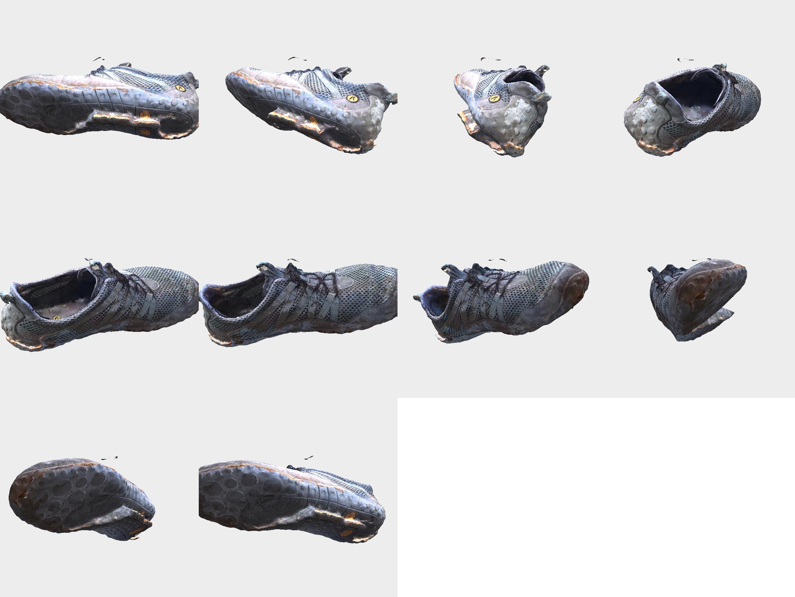

# Vibram/Merrell — reconstrucción 3D a máxima calidad desde **vídeo propio**

Reconstrucción fotogramétrica de una zapatilla **Vibram/Merrell real** (la del
usuario) a partir de **5 vídeos de móvil**, con el mismo pipeline COLMAP→OpenMVS
a máxima calidad que validamos en los experimentos anteriores, corriendo **nativo
en Apple Silicon (M3 Pro, 36 GB, sin CUDA)**.

> **Qué demuestra esto (y por qué importa):** los experimentos `max_quality_*`
> anteriores partían de *renders* de un GLB de retail (captura idealizada), así que
> validaban el *pipeline* pero **no** una adquisición física real. Esta carpeta es
> la **primera reconstrucción de un objeto físico real** capturado por el usuario:
> sin copyright, totalmente replicable con tus propias fotos/vídeos.

---

## Resultado

- Malla propia: **205.828 vértices / 411.322 caras**, atlas de textura **4096 px**
  (límite fijado en 8192; OpenMVS generó 1 atlas de 4096² con 37.313 parches).
- **Cobertura 360° completa**: suela (con el octógono *Vibram* y la *M* de Merrell
  legibles), laterales con malla y cordones, puntera, talón e **interior**.
- GLB listo para web: `result_model/vibram.glb` (31 MB, textura embebida).



**Verlo de forma interactiva** (girar / zoom / desplazar):

```bash
bash serve_viewer.sh            # http://127.0.0.1:8781/viewer.html
```

o arrastra `result_model/vibram.glb` a <https://modelviewer.dev/editor/> o a Blender
(`File ▸ Import ▸ glTF`), o abre la malla en MeshLab:
`open -a meshlab result_model/scene_textured.obj`.

---

## El reto de esta captura (y cómo se resolvió)

Estos vídeos **no** son una captura fotogramétrica de manual; son 5 clips de
WhatsApp grabados a mano. Tres problemas y sus soluciones:

| Problema | Por qué rompe la fotogrametría | Solución aplicada |
|---|---|---|
| **El objeto se recoloca entre clips** (suela arriba en uno, de pie en otro…) | COLMAP asume escena estática; con el suelo visible, SfM se "engancha" al suelo y ve la zapatilla *moverse* → no reconstruye | **Máscaras de primer plano + `--ImageReader.mask_path`**: SIFT solo dispara sobre la zapatilla, nunca el suelo → COLMAP la trata como **un único objeto rígido** y **fusiona los 5 clips** |
| **Orientación mixta** (4 clips horizontales 848×478 + 1 vertical 478×850) | `--single_camera` exige dimensiones uniformes | El clip vertical se **transpone a horizontal** y se recorta a 848×478 → **una sola cámara** compartida |
| **Vídeo de baja resolución y movido** (848×478, compresión WhatsApp, desenfoque de movimiento) | Fotogramas borrosos arruinan el *matching* SIFT y disparan el coste O(n²) | **Filtro de nitidez** (varianza del laplaciano): se parte cada clip en segmentos y se queda el fotograma **más nítido** de cada uno |

> **Expectativas honestas:** la fidelidad está **acotada por el origen** (848×478 +
> compresión WhatsApp + grabado a mano). No esperes el detalle de los renders
> sintéticos a 1280². Aun así, la **cobertura es más completa** que cualquier clip
> individual porque se fusionan las 5 tomas. Las zonas más débiles son el interior
> profundo (6–7 fotogramas verticales muy picados no registraron) y los reflejos
> especulares de la mediasuela.

---

## Pipeline (reproducible de principio a fin)

Todo lo necesario está en esta carpeta. Desde `experiments/vibram/`:

```bash
# 1) Extraer el máximo de fotogramas ÚTILES (nítidos, bien repartidos) de los 5 vídeos
TOTAL=320 python3 extract_frames.py            # -> recon/images_orig/ (266 jpg, 848x478)

# 2) Máscaras de primer plano (zapatilla en blanco, suelo en negro)
python3 make_masks_u2net.py                    # -> recon/masks/ + recon/masks_colmap/

# 3) SfM COLMAP enmascarado (fusiona los 5 clips en un único modelo rígido)
bash run_colmap_vibram.sh                      # -> recon/colmap_ws/sparse/0  (259/266 reg.)

# 4) Densificar + malla + textura a MÁXIMA calidad (con máscaras + normalización de color)
PHOTOS_WS="$PWD/recon/colmap_ws" \
  COLMAP_IMAGES="$PWD/recon/images_orig" \
  MASKS="$PWD/recon/masks" \
  QUALITY=max COLOR_NORM=1 \
  bash ../openmvs/run_openmvs.sh photos        # -> recon/colmap_ws/openmvs/scene_textured.obj

# 5) Quitar 'floaters' (fragmentos sueltos de borde de máscara) + exportar GLB con textura
python3 clean_mesh.py \
  recon/colmap_ws/openmvs/scene_textured.obj \
  result_model/vibram.glb

# 6) Verlo
bash serve_viewer.sh
```

Cifras exactas, parámetros y decisiones en **[EVIDENCE.md](EVIDENCE.md)**.
Cómo grabar tú para máxima calidad (incl. zonas complejas) en
**[CAPTURA_VIDEO.md](CAPTURA_VIDEO.md)**.

---

## Archivos

| Archivo | Qué es |
|---|---|
| `extract_frames.py` | Extracción de fotogramas con filtro de nitidez + transposición del clip vertical |
| `make_masks_u2net.py` | Máscaras de primer plano: rembg **u2net** + *fallback* por color de suelo + limpieza |
| `make_masks_color.py` | Segmentador por color de suelo (Mahalanobis en LAB); usado como *fallback* |
| `run_colmap_vibram.sh` | SfM COLMAP **enmascarado** (mask_path) + umbrales robustos para vídeo de baja paralaje |
| `clean_mesh.py` | Quita componentes pequeños (floaters) preservando UV; exporta OBJ/GLB |
| `result_model/` | Modelo autocontenido + visor web (`viewer.html`, `vibram.glb`, OBJ/MTL/atlas) |
| `evidence/` | Imágenes de evidencia (fotogramas de entrada, máscaras, turntable del resultado) |
| `recon/` | Espacio de trabajo (fotogramas, máscaras, COLMAP, OpenMVS) — **gitignored**, se regenera |

Los binarios pesados (`recon/`, GLB, OBJ, atlas) están **gitignored**; se regeneran
con los pasos de arriba. Los **5 vídeos de origen** son material privado del usuario
y **no se versionan** (además macOS los marca con un ACL `com.apple.macl` que impide
leerlos fuera de la app que los recibió); viven en local junto a esta carpeta. El
proceso es **replicable** apuntando los scripts a *tus propios* vídeos —
ver **[CAPTURA_VIDEO.md](CAPTURA_VIDEO.md)**.
